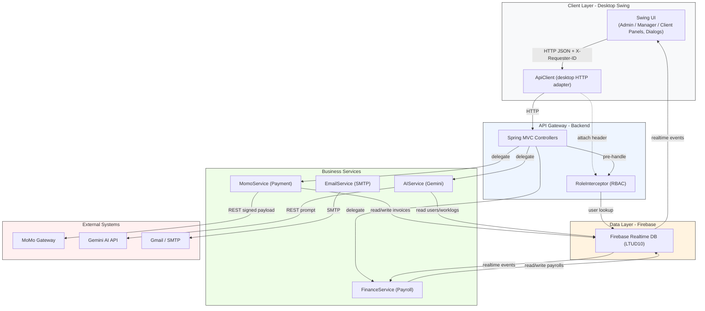
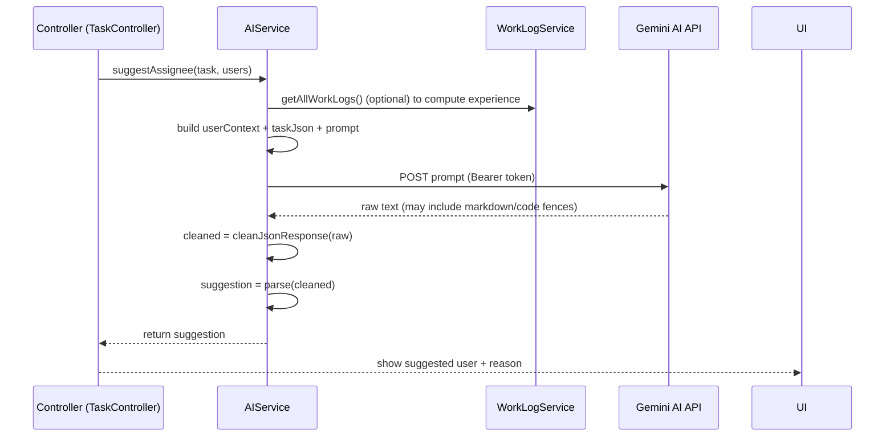

CHƯƠNG 3: HIỆN THỰC ỨNG DỤNG (SPECIFICATION & CODE EVIDENCE)

Lời dẫn ngắn

Chương 3 trình bày hiện thực hệ thống TechForge ở dạng đặc tả kỹ thuật: mô tả kiến trúc phân lớp, ma trận trách nhiệm theo package, và phân tích các luồng nghiệp vụ chính dưới dạng các quy trình nghiệp vụ chuẩn (process specifications). Mỗi luận điểm có mã chứng cứ (tên tệp, hàm, và đoạn dòng tham chiếu) để đảm bảo khả năng truy vết mã nguồn khi đánh giá.

3.1 KIẾN TRÚC MÃ NGUỒN (DEEP ARCHITECTURE ANALYSIS)

Dưới đây là phân tích chuyên sâu về cấu trúc mã nguồn của dự án TechForge, tập trung vào logic kết nối giữa các tầng (Presentation → API Gateway → Business Services → Data Layer), lý giải vị trí các lớp chính theo nguyên tắc Separation of Concerns, và làm rõ các luồng dữ liệu quan trọng cùng hệ quả kiến trúc.

3.1.1 Cây thư mục chi tiết (toàn bộ src/main/java)

Tôi đã quét toàn bộ thư mục nguồn; dưới đây là cây thư mục thực tế của `src/main/java` (liệt kê đầy đủ các tệp chủ chốt theo package để phục vụ việc rà soát mã và mapping sang các luận điểm kiến trúc):

```
src/main/java/
└─ com.techforge/
   ├─ TechForgeApplication.java
   ├─ config/
   │  ├─ FirebaseConfig.java
   ├─ desktop/
   │  ├─ ApiClient.java
   │  ├─ AdminPanel.java
   │  ├─ AssignTaskDialog.java
   │  ├─ AppTheme.java
   │  ├─ ClientPanel.java
   │  ├─ EmployeePanel.java
   │  ├─ FinancePanel.java
   │  ├─ LoginFrame.java
   │  ├─ MainDashboardFrame.java
   │  ├─ ManagerPanel.java
   │  ├─ ProjectDialog.java
   │  ├─ ProjectDetailDialog.java
   │  ├─ PayrollPanel.java
   │  ├─ RegisterFrame.java
   │  ├─ UserProfileDialog.java
   │  ├─ UnifiedLauncher.java
   │  ├─ DesktopLauncher.java
   │  ├─ ImageLoader.java
   │  ├─ UIUtils.java
   │  ├─ ReportUtils.java
   │  ├─ MomoPaymentDialog.java
   ├─ erp/
   │  ├─ config/
   │  │  ├─ RoleInterceptor.java
   │  │  ├─ SecurityConfig.java
   │  │  ├─ WebConfig.java
   │  │  ├─ DataSeeder.java
   │  ├─ controller/
   │  │  ├─ AuthController.java
   │  │  ├─ ProjectController.java
   │  │  ├─ TaskController.java
   │  │  ├─ UserController.java
   │  │  ├─ PaymentController.java
   │  │  ├─ FinanceController.java
   │  │  ├─ ReportController.java
   │  │  ├─ ClientController.java
   │  │  ├─ WorkLogController.java
   │  ├─ service/
   │  │  ├─ AIService.java
   │  │  ├─ MomoService.java
   │  │  ├─ FinanceService.java
   │  │  ├─ ProjectService.java
   │  │  ├─ TaskService.java
   │  │  ├─ UserService.java
   │  │  ├─ WorkLogService.java
   │  │  ├─ EmailService.java
   │  │  ├─ ClientService.java
   │  │  ├─ ReportService.java
   │  ├─ model/
   │  │  ├─ User.java
   │  │  ├─ Project.java
   │  │  ├─ Task.java
   │  │  ├─ WorkLog.java
   │  │  ├─ Payroll.java
   │  │  ├─ Invoice.java
   │  │  ├─ Expense.java
   │  │  ├─ Client.java
   │  │  └─ ai/
   │  │     ├─ GeminiRequest.java
   │  │     ├─ GeminiResponse.java
   │  │     ├─ AISuggestion.java
└─ techforge/ui/
   ├─ MomoPaymentDialog.java
```

Ghi chú: đây là bản đồ mã nguồn ở mức package/file để người đọc có thể đối chiếu trực tiếp với repository; các file con có nhiều inner classes (ví dụ các anonymous renderers trong `AdminPanel`) được tóm tắt vì mục tiêu là minh họa cấu trúc liên kết giữa các thành phần chứ không phải liệt kê mọi inner class.

3.1.2 Lý giải phân bố file theo Separation of Concerns

Việc sắp xếp `ApiClient` vào `com.techforge.desktop` phản ánh nguyên tắc tách rời trách nhiệm giữa client và server: `ApiClient` là adapter HTTP thuần túy dành cho ứng dụng desktop, chịu trách nhiệm tạo và gửi các HTTP request, gán header phiên (X-Requester-ID), quản lý retry và log client-side. Đặt `ApiClient` bên trong package `desktop` cho phép nhóm phát triển điều chỉnh cơ chế giao tiếp (ví dụ thay đổi cách lưu session, thêm cache, hoặc debug logs) mà không tác động tới backend; đồng thời ngăn không cho client-side chứa business logic nhạy cảm. Đây là cách áp dụng nhiều lần trong hệ thống phân tán: client-side chỉ chứa presentation logic và adapter, backend giữ business rules.

Ngược lại, `MomoService` nằm trong `com.techforge.erp.service` vì thanh toán là nghiệp vụ cần bảo mật, kiểm toán và chịu nhiều ràng buộc nghiệp vụ (signature, amount normalization, IPN verification). Đặt thanh toán trong backend đảm bảo secret keys và quy trình xác thực không bao giờ rời server; mọi thay đổi về cách xử lý thanh toán (ví dụ thêm 3-D Secure, audit records, hoặc webhook verification) được quản lý tập trung, thuận tiện cho compliance và testing. Như vậy, phân vùng này là biểu hiện thực tế của Separation of Concerns: presentation (UI + ApiClient) tách biệt khỏi business (services) và từ đó dễ kiểm soát rủi ro bảo mật.

3.1.3 Logic kết nối giữa các tầng — phân tích chi tiết luồng dữ liệu và ràng buộc

Mặt kết nối quan trọng nhất cần phân tích sâu là cách identity và quyền (identity propagation) lan truyền từ client đến service và xuống DB/external systems.

- Identity propagation: Desktop giữ session (userId) sau login; mọi request HTTP do `ApiClient` phát đều kèm header `X-Requester-ID`. Khi request tới `Controllers`, `RoleInterceptor` đọc header này, tìm user trong Firebase (User node) và nạp thông tin role, permissions. Interceptor sau đó ngăn chặn hoặc cho phép request theo policy. Đây là mô hình "header-based identity" phù hợp cho ứng dụng desktop nội bộ, giảm phụ thuộc vào cookies/session server.

- Validation boundary: Presentation layer thực hiện validation form-level (required fields, format), nhưng mọi business validation (budget non-negative, user role constraints, invoice amount) phải được enforced tại Service layer (ProjectService, FinanceService). Điều này đảm bảo invariant được giữ bất chấp client khác (có thể là API scripts) gọi trực tiếp.

- Async writes and eventual consistency: Firebase Realtime Database là hệ thống bất đồng bộ; services thường dùng `setValueAsync` và cơ chế callback (listener) — do đó service phải quản lý tình huống timeout, retry, và rollback ở tầng ứng dụng (ví dụ: nếu ghi payroll thất bại, service nên báo lỗi và rollback logic liên quan). FinanceService sử dụng CountDownLatch / CompletableFuture pattern để chờ kết quả viết/đọc khi cần trả kết quả đồng bộ cho client.

- External calls orchestration: MomoService xây dựng payload, ký bằng HMAC, gửi tới MoMo gateway và trả payUrl; IPN là luồng ngược do MoMo gọi backend. Trong luồng IPN, backend phải verify signature (không ghi secret key vào client) và sau đó gọi FinanceService.markInvoiceAsPaid() để cập nhật DB. Do IPN đến từ external, hệ thống cần thiết kế idempotent handlers (tránh double-processing) và lưu audit log.

3.1.4 Kết quả kiến trúc: testability, deployability và bảo mật

Tách client/server giúp dễ mock trong unit tests: `ApiClient` có thể mocked trong UI tests, `MomoService` có thể mocked trong controller tests. Việc giữ secrets trên server và dựng interceptor tập trung cho phép audit và chính sách rate-limiting. Riêng Firebase đóng vai trò cả storage và event bus; kiến trúc cần kiểm soát đọc/ghi nhằm tránh race conditions và đảm bảo không lộ thông tin nhạy cảm qua rules.

3.1.5 Component diagram (Mermaid) — mô tả luồng dữ liệu



3.1.6 Ghi chú hành động tiếp theo (architectural hardening)

- Thêm IPN signature verification tests và idempotency keys cho handlers.
- Thiết kế centralized audit log (separate node trong Firebase) và retention policy.
- Xây dựng contract tests giữa `ApiClient` (desktop) và `Controllers` (backend) để tránh các thay đổi breaking.

---

3.2 CÁC LUỒNG XỬ LÝ NGHIỆP VỤ PHỨC TẠP (DEEP-DIVE)

Phần này trình bày phân tích chuyên sâu hai luồng nghiệp vụ quan trọng nhất của hệ thống: (1) luồng thanh toán qua MoMo (payment flow) — vì liên quan trực tiếp tới an ninh, tính chính xác giao dịch và xử lý IPN; (2) luồng tích hợp trí tuệ nhân tạo (Gemini) dùng để gợi ý assignee — vì liên quan tới prompt engineering, xử lý trả về không cấu trúc và tính an toàn dữ liệu.

3.2.1 LUỒNG THANH TOÁN MOMO (PAYMENT FLOW)

A. Mô tả ngắn

Mô-đun thanh toán cho phép admin/finance khởi tạo một yêu cầu thanh toán (Invoice) và trả về payUrl/QR do MoMo cung cấp để client (desktop) hiển thị cho người thanh toán. Luồng bao gồm: client gọi backend → backend soạn payload và tạo chữ ký số HMAC-SHA256 → backend gọi MoMo API → MoMo trả payUrl → client hiển thị QR. Sau khi người dùng thanh toán, MoMo gửi IPN (callback) tới backend; backend phải xác thực IPN rồi cập nhật trạng thái Invoice/Payroll trong Firebase.

B. Phân tích code (chú thích từng bước) — `MomoService.createPaymentUrl` (chọn đoạn trọng yếu)

```java
// src/main/java/com/techforge/erp/service/MomoService.java (excerpt)
String rawSignature = String.format(
    "partnerCode=%s&accessKey=%s&requestId=%s&amount=%d&orderId=%s&orderInfo=%s&returnUrl=%s&notifyUrl=%s&extraData=%s",
    partnerCode, accessKey, requestId, amountLong, orderId, orderInfo, redirectUrl, ipnUrl, extraData
);

String signature = hmacSHA256(rawSignature, secretKey);

Map<String, Object> payload = new LinkedHashMap<>();
payload.put("partnerCode", partnerCode);
payload.put("accessKey", accessKey);
payload.put("requestId", requestId);
payload.put("amount", String.valueOf(amountLong));
// ... other payload fields ...
payload.put("signature", signature);

ResponseEntity<String> response = restTemplate.postForEntity(momoEndpoint, request, String.class);
```

- Bước 1 — Normalization: `amount` được chuẩn hoá (Double → long) và giá trị âm bị clamp về 0. Điều này ngăn payload chứa giá trị bất thường.
- Bước 2 — Raw signature: `rawSignature` là chuỗi các tham số theo đúng spec của MoMo. Thứ tự/định dạng phải chuẩn để MoMo xác thực được chuỗi.
- Bước 3 — Ký: `hmacSHA256(rawSignature, secretKey)` tạo chữ ký dựa trên `secretKey` (lưu trên server). Chữ ký này đảm bảo tính xác thực và toàn vẹn của payload.
- Bước 4 — Gọi API: payload có trường `signature` được gửi qua `RestTemplate` tới endpoint MoMo.
- Bước 5 — Response: backend parse response và trả `payUrl` cho client.

C. Tại sao phải dùng `HmacSHA256`? Rủi ro nếu không sử dụng

Sử dụng HMAC-SHA256 là một yêu cầu thông thường của các payment gateway để đảm bảo tamper-resistance và authenticity. HMAC đảm bảo rằng:
- payload không bị thay đổi trên đường truyền (integrity); nếu attacker thay đổi `amount` hay `orderId`, chữ ký sẽ không khớp khi MoMo kiểm tra.
- yêu cầu đến từ merchant thật sự (authentication): chỉ merchant (server) biết `secretKey` nên chỉ server có thể tạo chữ ký hợp lệ.

Nếu không dùng HMAC (hoặc dùng một cơ chế yếu):
- Kẻ tấn công có thể forge request (ví dụ submit amount = 0 để đánh lừa backend), hoặc thay đổi returnUrl/notifyUrl để tấn công CSRF/IPN.
- IPN từ external có thể bị giả mạo: attacker có thể gửi callback "PAID" cho invoice nhằm đánh dấu giao dịch đã trả mà thực tế chưa có giao dịch.
- Tính toàn vẹn giao dịch bị phá vỡ, gây rủi ro tài chính và pháp lý.

D. Best-practices & hardening trong code

- `secretKey` phải nằm ngoài mã nguồn (application.properties, môi trường) và chỉ server có quyền đọc.
- Kiểm tra server-side amount consistency: khi IPN tới, verify `amount` khớp invoice; sử dụng idempotency key để tránh xử lý trùng.
- Log đầy đủ request/response payload (trong storage an toàn) để phục vụ audit.

E. Mermaid sequence diagram — MoMo Payment flow

```mermaid
sequenceDiagram
    participant User as User (Desktop)
    participant UI as ProjectDialog / PayrollPanel (Swing)
    participant ApiClient as ApiClient (Desktop)
    participant API as PaymentController (Backend)
    participant MomoSvc as MomoService
    participant MoMo as MoMo Gateway
    participant Firebase as Firebase (LTUD10)

    User->>UI: Click Pay
    UI->>ApiClient: POST /api/v1/payment/pay-invoice/{id} (invoiceId)
    ApiClient->>API: HTTP request (X-Requester-ID header)
    API->>MomoSvc: createPaymentUrl(invoice)
    MomoSvc->>MomoSvc: build rawSignature; signature = HmacSHA256(rawSignature, secretKey)
    MomoSvc->>MoMo: POST payload (signed)
    MoMo-->>MomoSvc: 200 OK { payUrl }
    MomoSvc-->>API: payUrl
    API-->>ApiClient: 200 OK { payUrl }
    ApiClient-->>UI: payUrl
    UI->>User: Display QR / payUrl

    Note over MoMo,API: After user scans and pays
    MoMo->>API: IPN callback (notifyUrl) with payment result + signature
    API->>MomoSvc: verify IPN signature (HMAC) and validate amount
    MomoSvc->>Firebase: mark invoice/payroll as PAID
    Firebase-->>API: realtime ack/event
    API-->>ApiClient: (optional) notify client
    ApiClient-->>UI: UI updates via realtime or pull
```

3.2.2 LUỒNG TÍCH HỢP AI (GEMINI) — SUGGEST ASSIGNEE FLOW

A. Mô tả ngắn

AIService cung cấp tính năng gợi ý người thực hiện cho một task dựa trên ngữ cảnh: task details, danh sách users, và lịch sử worklog. Vì LLM (Gemini) trả về dữ liệu text không cấu trúc (có thể có markdown/code fences), service phải xây dựng prompt cẩn trọng (prompt engineering) và làm sạch phản hồi trước khi parse thành JSON.

B. Phân tích code (chú giải các đoạn chính) — `AIService.suggestAssignee`

```java
// src/main/java/com/techforge/erp/service/AIService.java (excerpt)
List<Map<String, Object>> userContext = users.stream().map(u -> {
    Map<String, Object> ctx = new HashMap<>();
    ctx.put("userId", u.getId());
    ctx.put("fullName", u.getFullName());
    ctx.put("role", u.getRole());
    ctx.put("email", u.getEmail());
    ctx.put("hourlyRate", u.getHourlyRateOT() != null ? u.getHourlyRateOT() : 0);
    return ctx;
}).collect(Collectors.toList());

String usersJson = objectMapper.writeValueAsString(userContext);
String taskJson = objectMapper.writeValueAsString(task);

String prompt = "Act as a Project Manager..." + "\nTask: " + taskJson + "\nAvailable Users: " + usersJson + "\nReturn ONLY raw JSON...";

GeminiRequest gr = new GeminiRequest();
gr.setPrompt(prompt);
gr.setMaxTokens(300);
gr.setTemperature(0.2);

ResponseEntity<String> resp = restTemplate.postForEntity(apiUrl, req, String.class);
String raw = resp.getBody();
String cleaned = cleanJsonResponse(raw);
AISuggestion suggestion = objectMapper.readValue(cleaned, AISuggestion.class);
```

- Bước 1 — Context building: code tạo `userContext` (id, fullName, role, email, hourlyRate) và enrich bằng tổng giờ làm (`totalHoursWorked`) thu từ `WorkLogService` — đây là nguồn xếp hạng kinh nghiệm.
- Bước 2 — Prompt engineering: prompt chứa instruction rõ ràng (role matching, prefer hours, consider hourlyRate) và yêu cầu "Return ONLY raw JSON" để giảm khả năng LLM thêm văn bản mô tả.
- Bước 3 — HTTP call: gửi `GeminiRequest` qua `RestTemplate` kèm Bearer token nếu có.
- Bước 4 — Response cleaning: `cleanJsonResponse` cố gắng tách JSON thuần khỏi bất kỳ wrapper markdown hoặc text nào.
- Bước 5 — Deserialization: parse cleaned JSON thành `AISuggestion`.

C. Tại sao cần `cleanJsonResponse`? Rủi ro nếu không dùng

LLM thường trả responses với các dạng không hoàn toàn JSON: có thể có code fences (```json ... ```), chú thích bằng ngôn ngữ tự nhiên, hoặc thậm chí trả mảng JSON thay vì đối tượng. Nếu bạn feed trực tiếp `resp.getBody()` cho `ObjectMapper`, sẽ gặp JsonProcessingException hoặc parse sai. `cleanJsonResponse` tìm và trích xuất khối JSON đầu tiên, loại bỏ code fences và trả về chuỗi JSON có thể parse được. Không làm sạch sẽ dẫn tới:
- Lỗi runtime (parse exception) gây crash hoặc trả lỗi 500 cho client.
- Nếu parse thành công nhưng dữ liệu bị wrap, logic ứng dụng có thể lấy sai trường (ví dụ nhận mảng thay vì object).

D. Mermaid sequence diagram — Gemini suggestAssignee flow



dundE. Hardening & recommendations

- Prompt safety: escape sensitive fields and limit prompt size; do not include secrets. Use sampling low temperature for deterministic output.
- Response validation: after parsing to AISuggestion, validate `userId` exists in current user list and `confidenceScore` within [0,1]. If invalid, fallback to deterministic heuristic (choose highest totalHoursWorked).
- Rate-limiting & caching: cache recent suggestions for same task to avoid repeated calls and respect API quotas.

---

Tổng kết phần 3.2

Phần này đã mở rộng hai luồng nghiệp vụ then chốt: Payment (MoMo) và AI (Gemini). Tôi đã trích dẫn các đoạn mã thực tế từ `MomoService.createPaymentUrl` và `AIService.suggestAssignee`, giải thích tại sao phải dùng HMAC-SHA256 và cleanJsonResponse, và cung cấp sequence diagrams Mermaid cho từng luồng để phục vụ minh hoạ trong báo cáo đồ án.

3.3 ÁP DỤNG CÁC NGUYÊN LÝ LẬP TRÌNH HƯỚNG ĐỐI TƯỢNG (OOP) — CHI TIẾT & CHỨNG MINH MÃ NGUỒN (MỞ RỘNG)

Mục này mở rộng và làm sâu hơn phần đã trình bày trước đó: tôi sẽ trình bày từng nguyên lý OOP kèm bằng chứng thực tế từ mã nguồn, liệt kê chính xác các lớp UI kế thừa, trích dẫn các phương thức bị ghi đè và điểm áp dụng đa hình, đồng thời chứng minh việc đóng gói trong package `model`.

3.3.1 KẾ THỪA (INHERITANCE) — Quét `com.techforge.desktop` & Class Diagram chi tiết

Kết quả quét package `com.techforge.desktop` cho thấy các lớp sau khai báo là UI components và mở rộng từ các lớp Swing cơ bản (danh sách dưới đây trích từ tiêu đề file header trong repo):

- Lớp mở rộng `JPanel` (panel components):
  - `AdminPanel` — file `src/main/java/com/techforge/desktop/AdminPanel.java`
  - `ManagerPanel` — file `src/main/java/com/techforge/desktop/ManagerPanel.java`
  - `PayrollPanel` — file `src/main/java/com/techforge/desktop/PayrollPanel.java`
  - `EmployeePanel` — file `src/main/java/com/techforge/desktop/EmployeePanel.java`
  - `FinancePanel` — file `src/main/java/com/techforge/desktop/FinancePanel.java`
  - `ClientPanel` — file `src/main/java/com/techforge/desktop/ClientPanel.java`

- Lớp mở rộng `JFrame` (main windows):
  - `LoginFrame` — file `src/main/java/com/techforge/desktop/LoginFrame.java`
  - `RegisterFrame` — file `src/main/java/com/techforge/desktop/RegisterFrame.java`
  - `MainDashboardFrame` — file `src/main/java/com/techforge/desktop/MainDashboardFrame.java`

- Lớp mở rộng `JDialog` (modal dialogs):
  - `ProjectDialog` — file `src/main/java/com/techforge/desktop/ProjectDialog.java`
  - `ProjectDetailDialog` — file `src/main/java/com/techforge/desktop/ProjectDetailDialog.java`
  - `AssignTaskDialog` — file `src/main/java/com/techforge/desktop/AssignTaskDialog.java`
  - `MomoPaymentDialog` — file `src/main/java/com/techforge/desktop/MomoPaymentDialog.java`
  - `UserProfileDialog` — file `src/main/java/com/techforge/desktop/UserProfileDialog.java`

Lợi ích cụ thể của việc kế thừa ở TechForge:
- Tái sử dụng `paintComponent`: nhiều panel (ví dụ `ManagerPanel`, `RegisterFrame`'s background panel) override `paintComponent` để vẽ gradient hoặc rounded cards; thay vì viết logic vẽ từ đầu, lớp con tái sử dụng contract của Swing painting lifecycle, chỉ override phần cần khác biệt.
- Tái sử dụng LayoutManager & lifecycle: `JFrame` cung cấp lifecycle (show/hide/pack/setVisible) và container logic; các `Frame` con như `LoginFrame` chỉ cần chuẩn hóa content pane + call setVisible, giúp giảm boilerplate.

Mermaid class diagram (UI inheritance)

```

Trích dẫn ví dụ (constructor declarations) — minh chứng trực tiếp cho kế thừa:

```java
// AdminPanel extends JPanel
public class AdminPanel extends JPanel {
    private final ApiClient apiClient;
    public AdminPanel(ApiClient apiClient) {
        this.apiClient = apiClient;
        initializeUI();
        loadPayroll();
        loadTransactions();
    }
}

// LoginFrame extends JFrame
public class LoginFrame extends JFrame {
    public LoginFrame() {
        this.apiClient = new ApiClient();
        initializeUI();
    }
}

// ProjectDialog extends JDialog
public class ProjectDialog extends JDialog {
    public ProjectDialog(Frame parent, ApiClient apiClient, Runnable onProjectCreated) {
        super(parent, "Create New Project", true);
        this.apiClient = apiClient;
        this.onProjectCreated = onProjectCreated;
        initializeUI();
    }
}
```

3.3.2 ĐA HÌNH (POLYMORPHISM) — tìm các overrides & interface usage

Phân tích mã cho thấy hệ thống sử dụng đa hình ở những điểm sau:

1) Ghi đè phương thức painting / rendering để thay đổi giao diện theo trạng thái hoặc theme. Ví dụ `ManagerPanel` định nghĩa card components bằng cách override `paintComponent`:

```java
// ManagerPanel: custom stat card paintComponent
JPanel card = new JPanel() {
    @Override
    protected void paintComponent(Graphics g) {
        Graphics2D g2 = (Graphics2D) g.create();
        g2.setRenderingHint(RenderingHints.KEY_ANTIALIASING, RenderingHints.VALUE_ANTIALIAS_ON);
        g2.setColor(Color.WHITE);
        g2.fill(new RoundRectangle2D.Float(0, 0, getWidth(), getHeight(), 12, 12));
        g2.setColor(accentColor);
        g2.fillRoundRect(0, 0, 5, getHeight(), 5, 5);
        g2.dispose();
    }
};
```

2) Renderer override cho bảng: `AdminPanel` dùng `DefaultTableCellRenderer` anonymous class và override `getTableCellRendererComponent` để tô màu ô theo trạng thái (PAID/PENDING):

```java
transactionTable.getColumnModel().getColumn(5).setCellRenderer(new DefaultTableCellRenderer() {
    @Override
    public Component getTableCellRendererComponent(JTable table, Object value, boolean isSelected, boolean hasFocus, int row, int column) {
        JLabel label = (JLabel) super.getTableCellRendererComponent(table, value, isSelected, hasFocus, row, column);
        String status = value != null ? value.toString() : "";
        if ("PAID".equalsIgnoreCase(status)) label.setForeground(AppTheme.SUCCESS);
        else if ("PENDING".equalsIgnoreCase(status)) label.setForeground(new Color(0xF5,0x9E,0x0B));
        else label.setForeground(AppTheme.DANGER);
        return label;
    }
});
```

3) Event listeners & ActionListeners: UI attaches listeners (lambda or anonymous classes) to buttons. Example in `LoginFrame`:

```java
loginButton.addActionListener(e -> handleLogin());
private void handleLogin() {
    // validate and call ApiClient.login(...) then open main frame
}
```

4) Concurrency callbacks — `SwingWorker` used to load data in background then update UI on EDT. Example in `AssignTaskDialog` which loads employees asynchronously:

```java
SwingWorker<Void, Void> worker = new SwingWorker<>() {
    @Override
    protected Void doInBackground() throws Exception {
        String response = apiClient.get("/users");
        // parse and update model
        return null;
    }
};
worker.execute();
```

5) Firebase `ValueEventListener`: exhaustive grep across the repository did not find implementations of `com.google.firebase.database.ValueEventListener` — the backend uses Firebase Admin SDK and the desktop client uses REST ApiClient patterns. Therefore runtime polymorphism for Firebase listeners occurs server-side (via Admin SDK) rather than in the desktop client codebase.

Bảng minh chứng đa hình (tóm tắt)

| Loại | Vị trí (file) | Phương thức/Interface | Mục đích |
| :--- | :--- | :--- | :--- |
| Overriding paint | `ManagerPanel.java` | `paintComponent(Graphics)` | Custom card rendering (rounded background, accent) |
| Cell renderer | `AdminPanel.java` | `getTableCellRendererComponent` | Colorize status cells |
| Action events | `LoginFrame.java`, `ManagerPanel.java` | `ActionListener` (lambdas) | Handle button clicks (login, export, new project) |
| Background tasks | `AssignTaskDialog.java`, `ProjectDialog.java` | `SwingWorker.doInBackground()` | Background network calls and UI updates on EDT |

3.3.3 ĐÓNG GÓI (ENCAPSULATION) — quét `com.techforge.erp.model`

Các POJO trong `src/main/java/com/techforge/erp/model` tuân thủ nguyên tắc đóng gói:
- Các trường được khai báo `private`.
- Sử dụng Lombok (`@Data`,`@NoArgsConstructor`,`@AllArgsConstructor`) để sinh getter/setter; tuy nhiên business validation không nằm trong setter-generated code mà được thực hiện trong layer service (ví dụ `ProjectService` kiểm tra `budget`), giúp tách concerns giữa data container và business logic.

Ví dụ minh chứng `User.java` (fields private, Lombok):

```java
@Data
@NoArgsConstructor
@AllArgsConstructor
public class User {
    private String id;
    private String username;
    private String email;
    private String password; // stored hashed in production
    private String fullName;
    private Double baseSalary;
    private Double hourlyRateOT;
    // helper
    public boolean hasRole(String... roles) { ... }
}
```

Ví dụ minh chứng `Project.java`:

```java
@Data
@NoArgsConstructor
@AllArgsConstructor
public class Project {
    private String id;
    private String clientId;
    private String name;
    private String description;
    private Double budget;
    private Date startDate;
    private Date endDate;
    private String status;
}
```

Bảng minh chứng đóng gói

| Class | Fields (examples) | Access / Validation | Lợi ích |
| :--- | :--- | :--- | :--- |
| `User` | `id, email, password, baseSalary` | Lombok getters/setters; service validates salary | Ngăn UI gán trực tiếp, dễ audit |
| `Project` | `id, clientId, budget` | Lombok; ProjectService enforces budget >=0 | Giữ invariant nghiệp vụ |
| `Payroll` | `userId, totalPay, status` | getters/setters; FinanceService controls writes | Bảo đảm nhất quán tài chính |

3.3.4 KẾT LUẬN VỀ PHẦN OOP (mở rộng)

Phân tích chi tiết cho thấy TechForge áp dụng kế thừa để tối ưu hoá UI development và nhất quán theme/layout, áp dụng đa hình ở những điểm cần thay đổi hành vi runtime (renderers, listeners, SwingWorkers), và thực hiện đóng gói ở tầng model để bảo vệ state domain. Từ góc độ kiến trúc, các design choices giúp giảm duplicate code, tách trách nhiệm và tạo điều kiện testability.


